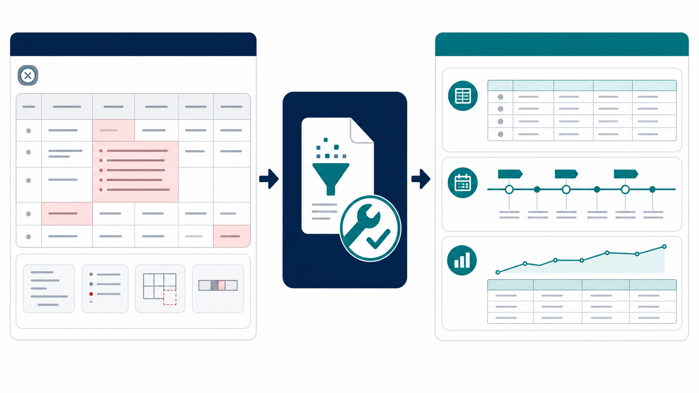

*다른 언어로 읽기: [English](README.md), [한국어](README.ko.md)*

# Data Refinery



> **데이터를 정리·정규화하여 분석 가능한 형태로 준비합니다.**

Data Refinery는 복잡하거나 깨진 원본 데이터를 분석에 바로 쓸 수 있는
형태로 정리하는 Windows 데스크톱 앱입니다. CSV의 깨진 레코드를 복구하고,
프로모션 규칙을 정규화된 기준 데이터로 보존하며, 분석이 필요할 때 일별
시계열 데이터를 생성합니다.

이 앱은 여러 데이터 정규화 기능을 모으는 기반입니다. 향후 가격 정보와
기타 업무 데이터용 템플릿을 추가해도 프로모션 기준 데이터와 섞이지 않게
설계합니다.

## 현재 기능

- **CSV 구조 복구** — 따옴표 없이 셀 안 줄바꿈으로 쪼개진 레코드를
  복구하고, 구분 기호·인코딩을 감지하며, 잘못된 상단 행을 제외해 한 행당
  하나의 레코드가 되도록 CSV 또는 Excel 파일로 저장합니다.
- **영문·폴란드 숫자 인식** — `1,234.56`, `1 234,56`, `1.234,56` 표기를
  안전하게 처리하고, 소수점 자릿수와 Excel의 큰 숫자 정밀도를 보호합니다.
- **프로모션 시계열 정규화** — `Promotion_Master`, `Support_Rules` 시트가
  있는 Excel 템플릿을 검증하고, 기간별 기준 규칙은 작게 보존하면서 필요할
  때 일별 지원금 데이터를 생성합니다. 겹치는 규칙은 자동 합산하지 않습니다.
- **쉬운 다국어 작업 화면** — CSV 구조 복구와 프로모션 템플릿을 탭으로
  분리하고 영어·한국어·폴란드어로 제공합니다.
- **빠른 사용자별 설치** — Local AppData의 `onedir` 구조에서 실행되어,
  매번 단일 EXE를 푸는 지연 없이 시작합니다.
- **업데이트 안내** — 앱 시작을 지연시키지 않고 GitHub의 정식 새 버전을
  확인합니다. 24시간 캐시와 사용자 설정 토글을 제공합니다.

## 데이터 모델 방향

프로모션 규칙은 기간 단위의 작은 기준 테이블로 보존합니다. 일별 지원금
파일은 분석용 결과이며 기준 규칙을 대체하지 않습니다. 이후 가격 이력 등
다른 정규화 기능도 같은 원칙을 따릅니다. 즉, 기준 사실은 작게 유지하고
시계열 데이터는 분석이 필요할 때 생성합니다.

## 다운로드 및 실행

최신 릴리즈의 설치 파일 하나만 내려받으면 됩니다. 현재 Windows 사용자
계정에만 설치되며 Python이나 별도 라이브러리는 필요하지 않습니다.

👉 **[최신 설치 파일 다운로드](https://github.com/KwangBeomPark/DataRefinery/releases/latest)**

1. `App04_DataRefinery_Setup_v<version>.exe` 파일을 다운로드합니다.
2. 설치 파일을 실행하면 시작 메뉴와 바탕화면에 **Data Refinery** 바로가기가 만들어집니다.
3. 깨진 구분 파일은 **CSV 구조 복구**, 프로모션 자료는 **프로모션 템플릿** 탭에서 처리합니다.
4. 결과는 원본 파일과 같은 폴더에 `YYYYMMDD_HHMM` 형식의 날짜·시간을 붙여 저장됩니다.

## 개발

테스트 실행:

```powershell
python -m unittest discover -s tests -v
```

Windows 설치 파일 빌드:

```powershell
.\build_release.ps1
```
