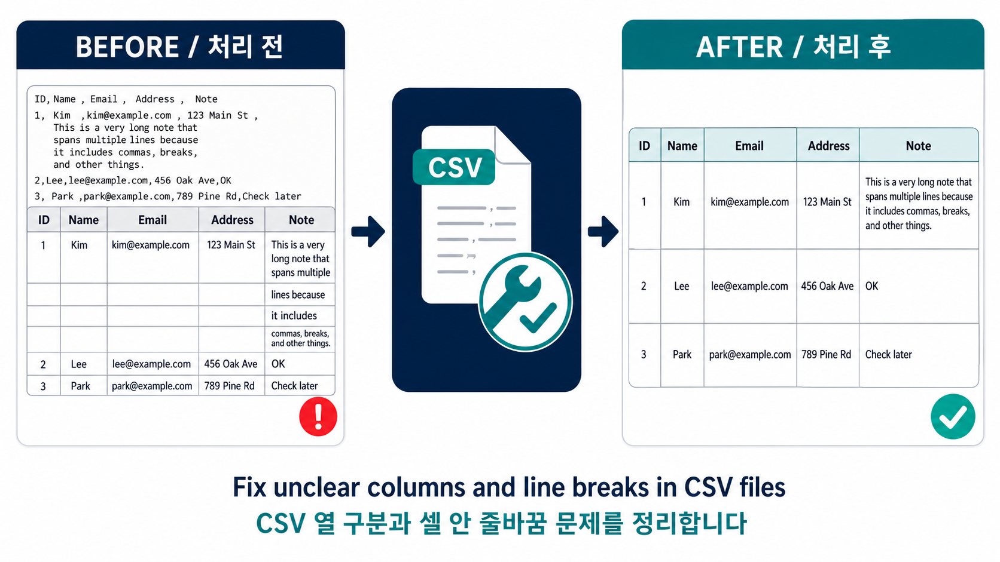

*Read this in other languages: [English](README.md), [한국어](README.ko.md)*

# CSV Modifier

> **Fix CSV files that Excel or Power Query cannot read cleanly.**

CSV Modifier is an intuitive CSV / TXT / Excel cleaning tool for non-technical users. It was built for files whose column separators are unclear or inconsistent, and for long text cells containing Enter/line-break characters that make one record look like several rows when opened in Excel or Power Query. It finds the intended table structure, repairs broken records, and creates a clean output with one record per row.

It also provides the following capabilities:

## Key Features
- **Safe Data Parsing**: Even if text (strings) contain line breaks (Enter), it reads them as a single cell without errors, just like Excel or Power Query. When exporting, internal cell line breaks (including special characters like vertical tab `\x0b`, U+2028, etc.) are replaced with spaces so that one record is stored in exactly one line.
- **Broken Multi-line Record Recovery**: For files where line breaks occur inside a cell without quotes causing a single record to split across multiple lines (a common defect in Excel exports), the program automatically pieces the fragments back together. The number of recovered rows is displayed in the result summary.
- **Direct Excel File Input**: Reads `.xlsx` / `.xlsm` files directly without converting them to CSV first. Cell values are imported with their original types, inherently preventing encoding or quoting issues.
- **English and Polish Number Format Conversion**: 
  - Cleanly converts Polish number formats (e.g., `1 234,56` or `1.234,56`) to valid floating-point numbers.
  - English number formats (e.g., `1,234.56`) are also supported and can be selected.
- **Automatic Variable Column Detection & Garbage Data Removal**: Analyzes the top rows of the file to infer the maximum number of columns. It ignores top garbage rows (Garbage Header) that lack enough columns, promotes the first valid row to the **actual header**, and extracts only the data.
- **Automatic Date/Number Type Conversion**: Converts date formats (e.g., `2026-07-14`, `14.07.2026`) to dates, and numbers to integers/decimals. If conversion fails, it retains the original text.
- **High-Precision & Original Format Preservation**: Numbers are parsed using `decimal.Decimal`, including Polish NBSP/narrow-NBSP separators and Unicode minus signs. Each cell retains its own decimal scale (e.g., `500,00` vs `1,2`). CSV output preserves the exact decimal value; values exceeding Excel's 15-significant-digit limit are written as text to avoid precision loss.
- **Output Format Selection**: 
  - Standard CSV format (uses semicolon `;` delimiter when Polish format is selected).
  - Direct export to Excel file (`.xlsx`).
- **Automatic Encoding & Delimiter Detection**: Prioritizes UTF-8 detection and automatically detects UTF-16 (with or without BOM), which is Excel's "Unicode Text" format. For legacy encodings (`cp949`, `cp1252`), it selects the one with the fewest broken characters, ensuring Korean Excel files are processed without text corruption. It also suggests a comma, semicolon, tab, or pipe delimiter without overriding a delimiter the user has entered manually.
- **High-Speed Processing for Large Files**: Optimizes date/number detection to process over 100,000 rows in seconds.
- **Plain-language Progress and Result Summary**: Shows a progress bar and keeps a visible in-app summary of the rows, numbers, dates, line breaks, and repaired records that were actually changed.
- **Timestamped Output Names**: Saves each cleaned file alongside the source as `processed_output_YYYYMMDD_HHMM.csv` or `.xlsx`, so a new run does not overwrite a previous one.

## Download & How to Run
You can download the standalone executable file (`.exe`) from the link below and use it immediately. No need to install Python or any additional libraries.

👉 **[Download Latest Version (v1.5.2)](https://github.com/KwangBeomPark/CSVmodifier/releases/tag/v1.5.2)**

1. Go to the link and download the `App04_csv_modifier_v1.5.2.exe` file.
2. Double-click the executable to open it.
3. Select the file to convert, use the on-screen examples to choose the number format, then click **[정리하고 저장하기]**.
4. A timestamped `processed_output_YYYYMMDD_HHMM.csv` (or `.xlsx`) will be created in the same folder as the original file.
